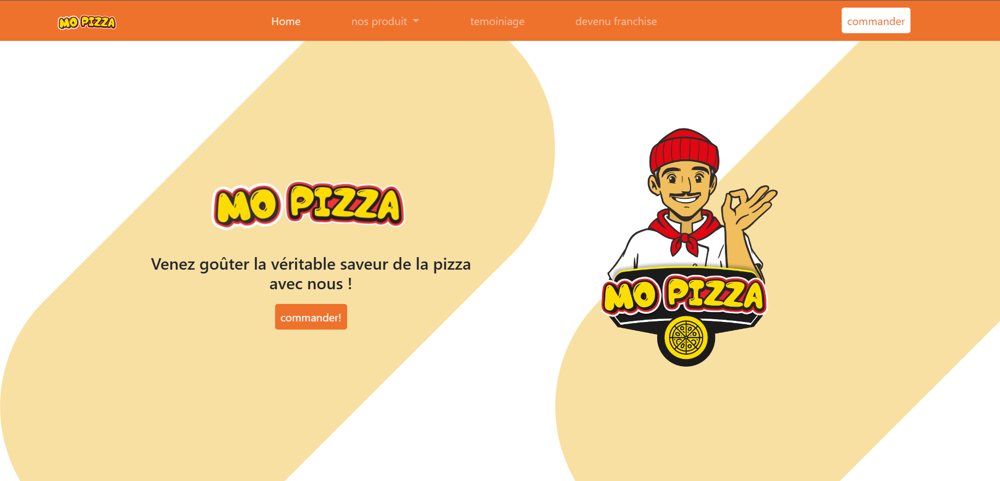

# Mourad Oudia's Pizza Shop Landing Page

Welcome to the repository for Mourad Oudia's Pizza Shop landing page! This project is a responsive landing page designed to showcase the offerings of Mourad Oudia's pizza shop. The page is built using HTML, CSS, Bootstrap, and AOS animation to ensure a modern and engaging user experience.

## Project Overview

The goal of this project is to create a visually appealing and user-friendly landing page for Mourad Oudia's pizza shop. The page is designed to be fully responsive, ensuring it looks great on all devices, from desktops to mobile phones.

## Features

- **Responsive Design:** The page adjusts seamlessly to different screen sizes using Bootstrap.
- **Animations:** Smooth animations are implemented using AOS (Animate On Scroll) library to enhance user engagement.
- **Modern Layout:** Clean and modern design to attract customers and provide an enjoyable browsing experience.
- **Interactive Elements:** Buttons and links with hover effects to improve interactivity.

## Technologies Used

- **HTML:** Structuring the content of the landing page.
- **CSS:** Styling the landing page with custom styles and Bootstrap.
- **Bootstrap:** Ensuring responsive design and layout consistency across devices.
- **AOS Animation:** Adding smooth scrolling animations to various elements on the page.

